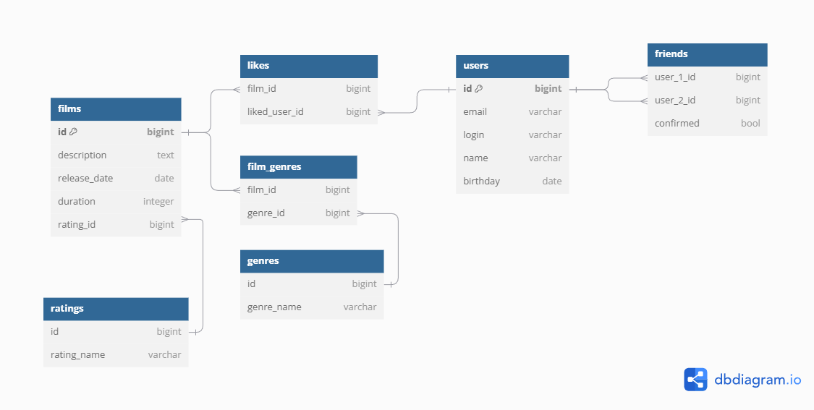

# 🎬 Java-Filmorate

## 🧩 Описание проекта

**Java-Filmorate** — это учебный проект, разработанный в рамках курса Яндекс.Практикума по Java-разработке. Цель проекта — создать backend-сервис для оценки и рекомендаций фильмов, реализующий основные функции социальной сети: добавление фильмов, оценка, рекомендации, управление друзьями и лента событий.

Проект помогает освоить ключевые аспекты разработки на Java, включая создание REST API, работу с базами данных, реализацию бизнес-логики и написание модульных тестов с использованием JUnit.

**Стек технологий:**

* Java 11
* Spring Boot
* Hibernate
* PostgreSQL
* Maven
* Lombok
* JUnit

## DB diagram



## ⚙️ Инструкция по развёртыванию

### 📋 Системные требования

* Java Development Kit (JDK) 11
* PostgreSQL
* Maven

### 🚀 Установка и запуск

1. Клонируйте репозиторий:

   ```bash
   git clone https://github.com/Klasix12/java-filmorate.git
   cd java-filmorate
   ```

2. Сборка проекта с использованием Maven:

   ```bash
   mvn clean install
   ```

3. Запустите приложение:

   ```bash
   mvn spring-boot:run
   ```

4. Приложение будет доступно по адресу: `http://localhost:8080`
